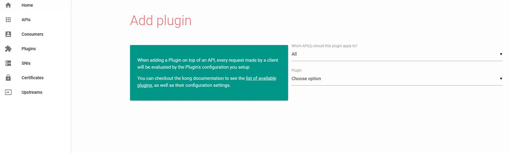

## Kong快速入门

#### 安装

[Docker Installation](https://docs.konghq.com/install/docker/)

```shell
# 获取镜像(我们这边使用私有库镜像)
docker pull 172.28.180.250:5000/kong
docker pull 172.28.180.250:5000/postgres:9.6

# 创建docker网络，用于容器之间的通信
docker network create kong-net

#创建kong使用的数据库
docker run -d --name kong-database \
              --network=kong-net \
              -p 5432:5432 \
              -e "POSTGRES_USER=kong" \
              -e "POSTGRES_DB=kong" \
              172.28.180.250:5000/postgres:9.6

# 配置数据库
docker run --rm \
    --network=kong-net \
    -e "KONG_DATABASE=postgres" \
    -e "KONG_PG_HOST=kong-database" \
    -e "KONG_CASSANDRA_CONTACT_POINTS=kong-database" \
     172.28.180.250:5000/kong:latest kong migrations up
# In the above example, both Cassandra and PostgreSQL are configured, but you should update the # KONG_DATABASE environment variable with either cassandra or postgres.   
    
#启动Kong           
 docker run -d --name kong \
    --network=kong-net \
    -e "KONG_DATABASE=postgres" \
    -e "KONG_PG_HOST=kong-database" \
    -e "KONG_CASSANDRA_CONTACT_POINTS=kong-database" \
    -e "KONG_PROXY_ACCESS_LOG=/dev/stdout" \
    -e "KONG_ADMIN_ACCESS_LOG=/dev/stdout" \
    -e "KONG_PROXY_ERROR_LOG=/dev/stderr" \
    -e "KONG_ADMIN_ERROR_LOG=/dev/stderr" \
    -e "KONG_ADMIN_LISTEN=0.0.0.0:8001, 0.0.0.0:8444 ssl" \
    -p 8000:8000 \
    -p 8443:8443 \
    -p 8001:8001 \
    -p 8444:8444 \
    172.28.180.250:5000/kong
    
    
# 浏览器确认
http://172.17.228.81:8001/
    
```

#### 5分钟快速入门

[《5-minute Quickstart》](https://docs.konghq.com/0.13.x/getting-started/quickstart/)

##### 注册服务

```sh
curl -i -X POST \
  --url http://172.17.228.81:8001/services/ \
  --data 'name=example-service' \
  --data 'url=http://baidu.com'
```

##### 为服务添加路由

```shell
curl -i -X POST \
  --url http://172.17.228.81:8001/services/example-service/routes \
  --data 'hosts[]=example.com'
```

##### 发送请求

```sh
curl -i -X GET \
  --url http://172.17.228.81:8000/ \
  --header 'Host: example.com'
```

##### 使用插件

```
curl -i -X POST \
  --url http://172.17.228.81:8001/services/example-service/plugins/ \
  --data 'name=key-auth'
  
# 验证插件的作用
curl -i -X GET \
   --url http://localhost:8000/ \
   --header 'Host: example.com'

# 返回401
HTTP/1.1 401 Unauthorized
Date: Fri, 29 Jun 2018 07:38:43 GMT
Content-Type: application/json; charset=utf-8
Transfer-Encoding: chunked
Connection: keep-alive
WWW-Authenticate: Key realm="kong"
Server: kong/0.13.1

{"message":"No API key found in request"}

```


#### Kong web界面

 项目地址 [**kong-dashboard**](https://github.com/PGBI/kong-dashboard)

```sh
docker pull pgbi/kong-dashboard
# 运行
docker run -d --name kong-dashboard \
		--rm -p 8080:8080 pgbi/kong-dashboard \
		start --kong-url http://172.17.228.81:8001
```

通过图形化界面管理Kong



#### Kong社区版支持的插件

插件说明 [plugins](https://konghq.com/plugins/)

##### 鉴权

| 认证 | 免费 | basic-auth | Basic Authentication     | 对于服务或者路由提供用户名/密码基本认证机制                |
| ---- | ---- | ---------- | ------------------------ | ---------------------------------------------------------- |
| 认证 | 免费 | key-auth   | Key Authentication       | 对于服务或者路由提供用关键字认证机制                       |
| 认证 | 收费 | -          | OpenID Connect           | 提供与三方OpenID的集成方式                                 |
| 认证 | 免费 | oauth2     | OAuth 2.0 Authentication | 添加OAuth 2.0认证                                          |
| 认证 | 收费 | -          | OAuth 2.0 Introspection  | 提供与三方OAuth 2.0认证服务器的集成方式                    |
| 认证 | 免费 | hmac-auth  | HMAC Authentication      | 提供HMAC（Hashed Message Authentication Code）签名认证方式 |
| 认证 | 免费 | jwt        | JWT                      | 提供JWT(JSON WEB Token)的认证方式                          |
| 认证 | 免费 | ldap-auth  | LDAP Authentication      | 提供了与LDAP认证服务器的集成方式                           |

##### 安全

| 安全 | 免费 | acl            | ACL            | 通过ACL(Access Control List)的组名称对服务或者路由进行黑白名单的访问控制 |
| ---- | ---- | -------------- | -------------- | ------------------------------------------------------------ |
| 安全 | 免费 | cors           | CORS           | 对服务或者路由提供CORS支持                                   |
| 安全 | 免费 | ip-restriction | IP Restriction | 通过IP地址对服务或者路由进行黑白名单的访问控制               |
| 安全 | 免费 | bot-detection  | Bot Detection  | 对服务或者路由提供机器人检出并能进行黑白名单的设定           |
| 安全 | 免费 | ssl            | Dynamic SSL    | 对路由或者API提供ssl支持                                     |

##### 流量控制 

| 流量控制 | 收费 | -                     | EE Canary Release      | 提供金丝雀发布支持                                     |
| -------- | ---- | --------------------- | ---------------------- | ------------------------------------------------------ |
| 流量控制 | 收费 | -                     | EE Forward Proxy       | 提供企业内网中前向代理的支持                           |
| 流量控制 | 收费 | -                     | EE Proxy Caching       | 提供代理缓存的加速功能                                 |
| 流量控制 | 免费 | request-size-limiting | Request Size Limiting  | 可以对请求的body的size进行限制                         |
| 流量控制 | 免费 | rate-limiting         | Rate Limiting          | 提供对给定时间段HTTP请求数目的控制功能                 |
| 流量控制 | 收费 | -                     | EE Rate Limiting       | CE版本Rate Limiting的强化                              |
| 流量控制 | 免费 | response-ratelimiting | Response Rate Limiting | 基于用户响应Header的信息，提供对HTTP请求数目的控制功能 |
| 流量控制 | 免费 | request-termination   | Request Termination    | 根据响应的状态码和信息，可停止对某个服务或者路由的流量 |

##### 分析和监控

| 分析&监控 | 免费 | zipkin   | Zipkin   | 提供兼容zipkin的方式对用户请求进行追踪       |
| --------- | ---- | -------- | -------- | -------------------------------------------- |
| 分析&监控 | 免费 | datadog  | Datadog  | 可将API的指标信息在datadog上进行可视化地展示 |
| 分析&监控 | 免费 | runscope | Runscope | 结合runscope进行API性能测试和监控            |

##### 转换

| 转换 | 免费 | request-transformer  | Request Transformer    | 通过kong对请求进行转换           |
| ---- | ---- | -------------------- | ---------------------- | -------------------------------- |
| 转换 | 收费 | -                    | EE request Transformer | request Transformer的强化版      |
| 转换 | 免费 | response-transformer | Response Transformer   | 通过kong对响应进行转换           |
| 转换 | 免费 | correlation-id       | Correlation ID         | 通过kong实现请求和响应之间的关联 |

##### 日志

| 日志 | 免费 | tcp-log  | TCP    | 发送请求和响应日志到TCP服务器    |
| ---- | ---- | -------- | ------ | -------------------------------- |
| 日志 | 免费 | udp-log  | UDP    | 发送请求和响应日志到UDP服务器    |
| 日志 | 免费 | http-log | HTTP   | 发送请求和响应日志到HTTP服务器   |
| 日志 | 免费 | file-log | File   | 发送请求和响应日志到磁盘的文件中 |
| 日志 | 免费 | statsd   | StatsD | 发送请求和响应日志到StatsD服务器 |
| 日志 | 免费 | syslog   | Syslog | 发送请求和响应日志到syslog中     |
| 日志 | 免费 | syslog   | Loggly | 发送请求和响应日志到Loggly服务器 |

#### 参考资料

+ [Install Kong](https://docs.konghq.com/install/ubuntu/)
+ [《Kong：插件介绍》](https://blog.csdn.net/liumiaocn/article/details/80488524)