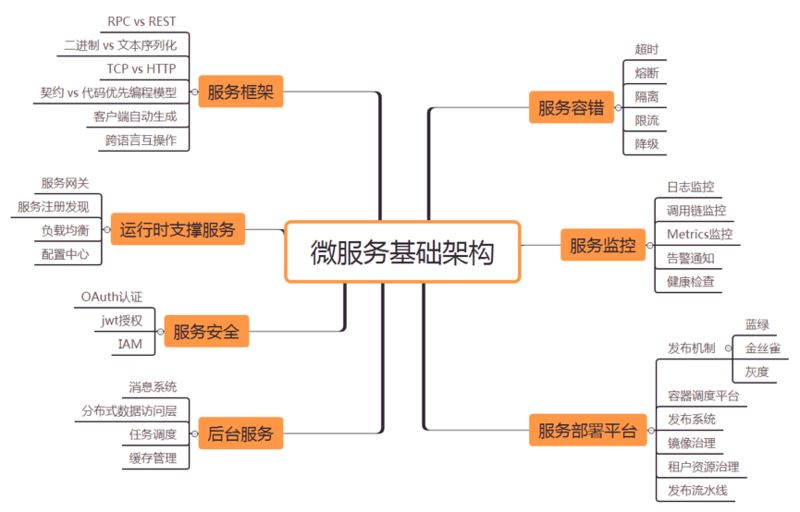

# 微服务基础框架Go版本

#### 微服务基础框架概览



### 服务框架

**go-micro**是一个插件式的RPC框架，所以其选择了RPC作为其交互方式。**micro**基于	**go-micro**开发工具集，支持HTTP与RPC的互操作，所以对外表现为HTTP,对内为RPC(内部也是支持HTTP协议的)。

详细参考 [API 网关](https://micro.mu/docs/api.html)部分 和 [example](https://github.com/feixiao/examples/tree/master/greeter)

### 运行时支撑服务

#### 配置中心

+ 参考项目

  + [config-srv](https://github.com/feixiao/config-srv)  A dynamic config service for microservices。
  + [config-web](https://github.com/feixiao/config-web)  A web app for the dynamic config service config-srv。

    上面的项目都是基于Consul实现（可以实现插件针对其他的工具进行实现）。

  + [github.com/micro/go-os/config](https://github.com/micro/go-os/tree/master/config)    **Note: This is still a work in progress**

+ 客户端的集成：目前在go-micro中并没有实现类似的功能，需要自己在业务中实现。

+ 开源的配置中心方案

  + [confd](https://github.com/kelseyhightower/confd)    使用go-micro和micro集成在自己的服务实现中即可。

#### 注册中心/服务注册和发现

##### 服务注册

+ Go Micro的 **registry** 包用于服务发现。后台支持consul, etcd, zookeeper, dns, gossip等等，默认使用的Consul，可以使用插件的形式支持其他后台实现。官方提供的[插件](https://github.com/micro/go-plugins/tree/master/registry)

+ go-micro的全部例子都是需要依赖注册中心，默认的实现是MDNS或者Consul。 [example/service](https://github.com/feixiao/examples/tree/master/service)

+ go-micro在Server包中实现Register方法注册不同的注册中心

  ```go
  type Server interface {
  	Options() Options
  	Init(...Option) error
  	Handle(Handler) error
  	NewHandler(interface{}, ...HandlerOption) Handler
  	NewSubscriber(string, interface{}, ...SubscriberOption) Subscriber
  	Subscribe(Subscriber) error
  	Register() error		// 注册
  	Deregister() error		// 注销
  	Start() error
  	Stop() error
  	String() string
  }
  ```

+ 注册中心的心跳检测 [heartbeat](https://github.com/micro-analysis/examples/tree/master/heartbeat)

##### 服务发现

+ go-micro 提供了 Registry**客户端**去做服务发现功能，需要业务层进行封装

  ```go
  type Registry interface {
  	Register(*Service, ...RegisterOption) error
  	Deregister(*Service) error
  	GetService(string) ([]*Service, error)
  	ListServices() ([]*Service, error)
  	Watch() (Watcher, error)
  	String() string
  }
  ```

+ **micro api** 中使用框架[go-api](https://github.com/micro-analysis/go-api) 中使用Registry接口获取服务信息，获取服务的时候以Namespace区分([router::refresh](github.com/micro-analysis/go-api/blob/master/router/router.go)中进行了过滤，实际使用go-micro的时候并没有这种限制)。

#### 服务网关

+ [Micro API](https://github.com/micro/micro/tree/master/api) 为访问微服务提供了 HTTP 服务和路由功能的 API 网管。在 Micro 中，它提供一个单一的入口，它可以被用作反向代理，或者将 HTTP 请求转换成 RPC。
+ [Kong](https://github.com/Kong/kong#features) 一个基于Nginx的API Gateway。提供了诸如身份认证，权限控制，流量控制，日志等一系列API相关的组件。 

#### 负载均衡

+ [roundrobin](https://github.com/micro-analysis/examples/tree/master/roundrobin) roundrobin的负载均衡实现,例子基于插件的形式实现，其实go-micro内置了两种实现**Random** 和**RoundRobin** 。


+ [selector](https://github.com/micro/go-micro/tree/master/selector) go-micro提供了Selector基于注册中心提供了负载均衡实现。通过修改select提供的策略可以达到目标[internal/handler/api.go](https://github.com/micro-analysis/micro/blob/master/internal/handler/api.go)  。


### 服务容错

go-mciro提供了client包用于其他服务，其中通过CallOptions设置调用控制。

```go
type CallOptions struct {
	SelectOptions []selector.SelectOption
	// Backoff func
	Backoff BackoffFunc	
	// Check if retriable func
	Retry RetryFunc					// 重试回调函数
	// Transport Dial Timeout
	DialTimeout time.Duration		// 连接情况时间超时
	// Number of Call attempts
	Retries int					    // 重试次数
	// Request/Response timeout
	RequestTimeout time.Duration	// 等待应答超时
	// Middleware for low level call func
	CallWrappers []CallWrapper
	// Other options for implementations of the interface
	// can be stored in a context
	Context context.Context
}
```

#### 超时

+ client中提供了调用服务的超时配置以及重试策略。

#### 熔断

+ go-micro中并没有熔断功能。
+ 可以参考[ServiceComb/go-chassis](http://github.com/ServiceComb/go-chassis)  其主要基于go-micro实现。从go-chassis的外部依赖分析熔断基于[Hystrix](https://github.com/Netflix/Hystrix)实现，[hystrix-go](https://github.com/afex/hystrix-go)。
+ go-kit的熔断实现基于基于[Hystrix](https://github.com/Netflix/Hystrix)实现，[hystrix-go](https://github.com/afex/hystrix-go)。

#### 隔离

没有实现相关功能。

#### 限流

+ go-micro中并没有提供服务器请求的限流功能。
+ 可以参考[ServiceComb/go-chassis](http://github.com/ServiceComb/go-chassis)  其主要基于go-micro实现,[qpslimiter](https://github.com/ServiceComb/go-chassis/blob/master/core/qpslimiter/qps_limiter.go) 。

#### 降级

没有实现相关功能。


### 服务监控

#### 日志监控

+ 日志使用[go-log/log ](https://github.com/go-log/log) Golang的统一的日志接口，只有Log和Logf函数，不能进行日志分级，输出目标地跟下面的使用的日志实现配置有关系。

#### 调用链监控

+ go-kit使用的[Zipkin](https://zipkin.io/)。
+ go-micro & micro 都没有直接集成。
+ go-kit使用的[Zipkin](https://zipkin.io/) 进行集成。

#### Metrics监控集成

+ go-micro没有提供现有的功能，同时micro也没有集成类似的功能。
+ go-kit有集成[metrics](https://github.com/go-kit/kit/tree/master/metrics),同时[ServiceComb/go-chassis](https://github.com/ServiceComb/go-chassis/tree/master/metrics) 也有集成，使用的都是[prometheus](https://prometheus.io/) 。

#### 告警通知

+ 使用[prometheus](https://prometheus.io/) 即可

#### 监控检查

+ 使用[prometheus](https://prometheus.io/) 即可

